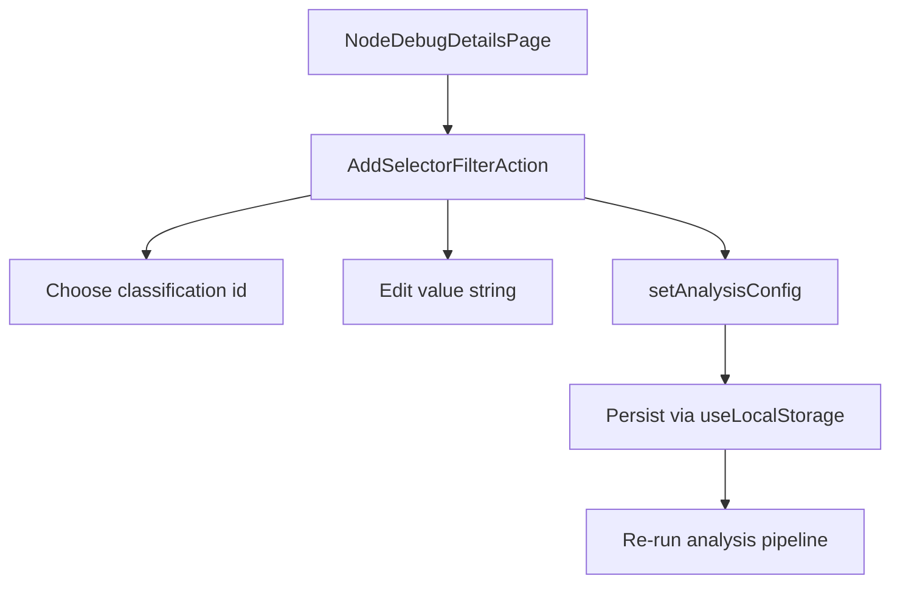

## Контекст и текущие точки интеграции

- Страница находится в `[src/routes/$projectId/node-debug-details/$nodeRef.tsx](/Users/lev/IdeaProjects/visualizer/src/routes/$projectId/node-debug-details/$nodeRef.tsx)` и рендерит `element.reference`, `element.decorators`, `element.parentClasses`.
- Конфиг хранится в `AnalysisConfig` и мутируется через контекст проекта (persist в localStorage) в `[src/contexts/project-analysis-context.tsx](/Users/lev/IdeaProjects/visualizer/src/contexts/project-analysis-context.tsx)`.
- Селекторы классификаций уже существуют в `[src/core/config/analysis-config.ts](/Users/lev/IdeaProjects/visualizer/src/core/config/analysis-config.ts)`:
  - `selectors.references[]`
  - `selectors.decoratedWith[]`
  - `selectors.childsOf[]`

## UX/поведение

- Рядом с каждой строкой (reference/decorator/parent class) появляется “ряд экшенов” (иконка), а сама строка стоновится из лист айтемов в отдельные лист-компоненты.
- Нажатие на экшен открывает попап (Popover):
  - Select “Классификация” (из `analysisConfig.classifications`, в порядке приоритета)
  - Input с предзаполненной строкой (точно исходная строка; пользователь может модифицировать)
  - Кнопка “Добавить”
- После “Добавить” строка добавляется в соответствующий массив селектора выбранной классификации:
  - из reference → `selectors.references[]`
  - из decorator → `selectors.decoratedWith[]`
  - из parentClass → `selectors.childsOf[]`
- Добавление идемпотентное (не дублировать одинаковые строки) и не добавлять пустые/пробельные.

## Переиспользуемая реализация (компоненты)

- Добавить новый UI-юнит, который можно воткнуть в любые “строчные списки”, не только debug:
  - `src/components/classification/add-selector-filter-action.tsx` (или ближе к `src/ui/organisms/…`, если вы предпочитаете атомарно)
  - API:
    - `kind: "reference" | "decorator" | "parentClass"`
    - `value: string` (предзаполняем input)
    - `projectId`/контекст берём из `useProjectAnalysis()` (уже есть доступ на страницах проекта)
    - опционально: `onAdded?()` чтобы родитель мог показать toast/закрыть меню и т.п.
- Внутри использовать существующие Radix wrappers:
  - Popover из `[src/ui/molecules/popover/popover.tsx](/Users/lev/IdeaProjects/visualizer/src/ui/molecules/popover/popover.tsx)`
  - Button из `[src/ui/molecules/button/button.tsx](/Users/lev/IdeaProjects/visualizer/src/ui/molecules/button/button.tsx)` (size `icon-sm`)
  - Tooltip из `[src/ui/molecules/tooltip/tooltip.tsx](/Users/lev/IdeaProjects/visualizer/src/ui/molecules/tooltip/tooltip.tsx)` для подписи и доступности
- Для выбора классификации:
  - Использовать **Toggle Group** компоненты (shad, radix)

## Изменения на debug-странице

- В `[src/routes/$projectId/node-debug-details/$nodeRef.tsx](/Users/lev/IdeaProjects/visualizer/src/routes/$projectId/node-debug-details/$nodeRef.tsx)`:
  - Сделать строки “reference/decorator/parent class” более выраженными (типографика/фон/рамка), и добавить справа контейнер экшенов.
  - Для каждого значения подключить `AddSelectorFilterAction` с правильным `kind` и `value`.

## Логика обновления конфигурации

- Использовать `setAnalysisConfig(prev => next)` из `useProjectAnalysis()`.
- Мержить в `prev.classifications`:
  - найти классификацию по `id`
  - взять нужный массив селектора (создать, если `undefined`)
  - добавить `value` (после trimming) если ещё нет
- Не трогать другие части конфига; положиться на существующую `normalizeAnalysisConfig`.

## Edge cases

- Если классификаций нет: в попапе показать пустое состояние и кнопку/ссылку “Создать классификацию” (вести на settings route `/$projectId/settings`).
- Если пользователь нажал “Добавить” без выбора классификации: disabled.

## Проверка

- Ручная проверка: добавить reference/decorator/parentClass в классификацию → перейти на страницу настроек и убедиться, что строка появилась в правильном selector.
- Убедиться, что после добавления анализ/граф пересчитывается как и после любых изменений `analysisConfig`.

