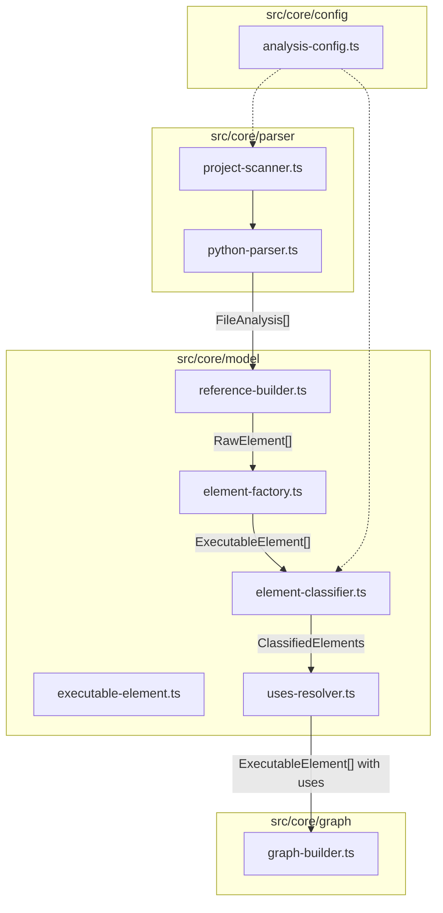

# Пайплайн анализа кода и визуализации графа

## Контекст

Текущий проект: Tauri + Vite + TanStack Start + React 19 + Tailwind v4. Есть страница `/$projectId` с выбором папки и подсчётом файлов. Тестовый Python-проект в `test_python_project/src/` содержит три модуля (`utils`, `core_module`, `export_module`) с классами, методами, функциями, декораторами и наследованием.

Новые зависимости: `ts-graphviz`, `@luciformresearch/codeparsers`

---

## Архитектура модулей




Поток данных:

1. `project-scanner` находит `.py` файлы, читает содержимое, передаёт в `python-parser`
2. `python-parser` вызывает `@luciformresearch/codeparsers`, возвращает `FileAnalysis[]`
3. `reference-builder` строит уникальные reference-строки из scopes (напр. `export_module.views.todotask.TodoTaskViewSet.list`)
4. `element-factory` создаёт `ExecutableElement` из промежуточных данных
5. `element-classifier` применяет пользовательские селекторы и назначает тип (Controlling / BusinessLogic / SideEffect)
6. `uses-resolver` разрешает зависимости между элементами на основе импортов и вызовов
7. `graph-builder` строит `ts-graphviz` Digraph с subgraph-группировкой по модулям и классам

---

## 1. Зависимости

```bash
pnpm add @ts-graphviz/react @luciformresearch/codeparsers
```

В [vitest.config.ts](vitest.config.ts) может потребоваться настройка `deps.optimizer` для WASM-пакетов codeparsers.

---

## 2. Типы конфигурации -- `src/core/config/analysis-config.ts`

```typescript
export interface SelectorConfig {
  references?: string[];
  childsOf?: string[];
  decoratedWith?: string[];
}

export interface AnalysisConfig {
  include: string[];
  exclude: string[];
  moduleDepth: number; // default 1
  selectors: {
    controlling: SelectorConfig;
    businessLogic: SelectorConfig;
    sideEffects: SelectorConfig;
  };
}
```

Ключ localStorage для конфига: `visualizer-analysis-config-{projectId}`.

---

## 3. Подмодуль парсера -- `src/core/parser/`

### `python-parser.ts`

Тонкая обёртка над `@luciformresearch/codeparsers`:

- Экспортирует `initParser()` (вызывает `parser.initialize()` один раз)
- Экспортирует `parseFile(filePath: string, content: string): Promise<FileAnalysis>`
- Внутри создаёт `PythonLanguageParser` как singleton

### `project-scanner.ts`

- `scanProject(rootPath: string, readFile: (path: string) => Promise<string>): Promise<FileAnalysis[]>`
- Принимает абстрактную функцию чтения файлов (Tauri FS в приложении, Node.js `fs` в тестах)
- Рекурсивно находит все `.py` файлы (через переданный `listDir` callback или аналог)
- Вызывает `parseFile` для каждого, возвращает массив `FileAnalysis`

### Тесты: `src/core/parser/__tests__/`

`**python-parser.test.ts**`:

- Парсит `test_python_project/src/utils/base_action.py` -- проверяет наличие scope с `type: 'class'`, `name: 'BaseBusinessAction'`
- Парсит `export_module/views/todotask.py` -- проверяет scopes: class `TodoTaskViewSet`, methods `list`, `export`; проверяет `heritageClauses` содержит `viewsets.ModelViewSet`
- Парсит `core_module/tasks/run_todo_sync.py` -- проверяет scope с `type: 'function'`, `decorators` содержит `shared_task`

`**project-scanner.test.ts**`:

- Сканирует `test_python_project/src/` целиком -- проверяет общее количество файлов (7 `.py` без `__init__.py`, или все если считать `__init__`), наличие всех ожидаемых путей

---

## 4. Подмодуль модели -- `src/core/model/`

### `executable-element.ts`

```typescript
export type ElementType = "controlling" | "businessLogic" | "sideEffect" | "unclassified";

export class ExecutableElement {
  readonly reference: string;
  readonly module: string;
  readonly className: string | null;
  readonly name: string;
  readonly type: ElementType;
  readonly decorators: string[];
  readonly parentClasses: string[];
  readonly sourceFile: string;
  readonly startLine: number;
  readonly endLine: number;
  uses: ExecutableElement[];

  constructor(params: ExecutableElementParams) { ... }
}
```

Дочерние классы -- **минимальные обёртки**, отличающиеся предустановленным `type`:

### `controlling-element.ts`

```typescript
export class ControllingElement extends ExecutableElement {
  constructor(params: Omit<ExecutableElementParams, 'type'>) {
    super({ ...params, type: 'controlling' });
  }
}
```

### `business-logic-element.ts`, `side-effect-element.ts`

Аналогично, с `type: 'businessLogic'` и `type: 'sideEffect'`.

### `reference-builder.ts`

- `buildReference(filePath: string, rootPath: string, scopeName: string, parentName?: string): string`
- Конвертирует путь файла в dot-нотацию: `export_module/actions/perform_export.py` + `PerformExport` + `execute` -> `export_module.actions.perform_export.PerformExport.execute`
- `getModuleName(reference: string, depth: number): string` -- возвращает первые N сегментов: depth=1 -> `export_module`

### `element-factory.ts`

- `createElementsFromAnalysis(analyses: FileAnalysis[], rootPath: string): ExecutableElement[]`
- Итерирует все scopes из всех FileAnalysis
- Фильтрует по `type` (class, function, method) -- пропускает `__init__` и прочие internal scopes
- Строит reference через `reference-builder`, создаёт `ExecutableElement` для каждого
- Извлекает `decorators`, `parentClasses` (из `heritageClauses`) из scope

### `element-classifier.ts`

- `classifyElements(elements: ExecutableElement[], config: AnalysisConfig): ExecutableElement[]`
- Применяет `include` / `exclude` фильтры (regex по reference)
- Для оставшихся проверяет селекторы (OR-логика внутри каждого):
  - `references` -- regex по `element.reference`
  - `childsOf` -- regex по `element.parentClasses`
  - `decoratedWith` -- regex по `element.decorators`
- Возвращает массив элементов с назначенным `type`
- Элементы, не попавшие ни в одну группу, помечаются `unclassified`

### `uses-resolver.ts`

- `resolveUses(elements: ExecutableElement[], analyses: FileAnalysis[]): void`
- Строит map: import name -> reference (из импортов каждого файла + map всех элементов по reference)
- Для каждого элемента анализирует `references` из соответствующего scope (поле `UniversalScope.references`) и матчит с известными элементами
- Мутирует `element.uses` -- заполняет массив ссылок на другие `ExecutableElement`

### Тесты: `src/core/model/__tests__/`

`**reference-builder.test.ts**`:

- `buildReference("export_module/views/todotask.py", "", "list", "TodoTaskViewSet")` === `"export_module.views.todotask.TodoTaskViewSet.list"`
- `buildReference("utils/base_action.py", "", "BaseBusinessAction")` === `"utils.base_action.BaseBusinessAction"`
- `getModuleName("export_module.views.todotask.TodoTaskViewSet.list", 1)` === `"export_module"`
- `getModuleName("export_module.views.todotask.TodoTaskViewSet.list", 2)` === `"export_module.views"`

`**element-factory.test.ts**`:

- Создаёт элементы из реального парсинга `test_python_project/src`
- Проверяет наличие ожидаемых reference:
  - `utils.base_action.BaseBusinessAction`
  - `export_module.views.todotask.TodoTaskViewSet.list`
  - `export_module.actions.perform_export.PerformExport.execute`
  - `export_module.tasks.run_exports.task_ExportAllTasks`
  - `core_module.tasks.run_todo_sync.task_RunTodoSync`
  - и др.
- Проверяет `parentClasses` у `GetTasksList` содержит `BaseBusinessAction`
- Проверяет `decorators` у `task_RunTodoSync` содержит `shared_task`

`**element-classifier.test.ts**`:

- Конфиг: `controlling.childsOf: ["ModelViewSet"]`, `businessLogic.childsOf: ["BaseBusinessAction"]`, `sideEffects.decoratedWith: ["shared_task"]`
- Проверяет: `TodoTaskViewSet.list` -> controlling, `GetTasksList.execute` -> businessLogic, `task_RunTodoSync` -> sideEffect
- Тест `include/exclude`: include `["export_module\\..*"]` -- остаются только элементы export_module
- Тест exclude: exclude `[".*\\._internal.*"]` -- `_internal_preconditions_check` и `_internal_empty` исключены

`**uses-resolver.test.ts**`:

- На данных `test_python_project/src`
- `PerformExport.execute` uses: `GetTasksList.execute`, `task_RunTodoSync`, `task_ExportAllTasks`
- `AddTaskToList.execute` uses: `GetTasksList.execute`

---

## 5. Подмодуль графа -- `src/core/graph/`

### `graph-builder.ts`

- `buildGraph(elements: ExecutableElement[], config: AnalysisConfig): Digraph`
- Создаёт `Digraph` из `ts-graphviz`
- Группирует элементы по `module` (через `getModuleName(ref, config.moduleDepth)`) -- каждый модуль = `Subgraph` с `label`
- Внутри модуля группирует по `className` -- если не null, создаёт вложенный `Subgraph` с label = className
- Для каждого элемента -- `Node` с id = reference, label = короткое имя (например `execute`)
- Атрибуты нод по типу: разные цвета/формы для controlling / businessLogic / sideEffect / unclassified
- Для каждого `element.uses` -- `Edge` от element к target

### Тесты: `src/core/graph/__tests__/graph-builder.test.ts`

- Строит граф из элементов `test_python_project/src`
- Использует `toDot(graph)` + `.toMatchSnapshot()` для верификации DOT-представления
- Отдельный snapshot-тест для разных конфигов: depth=1, depth=2
- Snapshot тест с include/exclude фильтрами

Пример ожидаемого DOT (приблизительно):

```dot
digraph {
  subgraph "cluster_utils" {
    label = "utils";
    "utils.base_action.BaseBusinessAction";
  }
  subgraph "cluster_core_module" {
    label = "core_module";
    subgraph "cluster_core_module_GetTasksList" {
      label = "GetTasksList";
      "core_module...GetTasksList.execute";
    }
    subgraph "cluster_core_module_AddTaskToList" {
      label = "AddTaskToList";
      "core_module...AddTaskToList.execute";
      "core_module...AddTaskToList._internal_preconditions_check";
      "core_module...AddTaskToList._internal_empty";
    }
    "core_module.tasks.run_todo_sync.task_RunTodoSync";
  }
  subgraph "cluster_export_module" {
    label = "export_module";
    ...
  }
  // edges
  "...PerformExport.execute" -> "...GetTasksList.execute";
  "...PerformExport.execute" -> "...task_RunTodoSync";
  "...PerformExport.execute" -> "...task_ExportAllTasks";
}
```

---

## 6. Оркестрация -- `src/core/analyze.ts`

Единая точка входа:

```typescript
export async function analyzeProject(
  rootPath: string,
  config: AnalysisConfig,
  readFile: (path: string) => Promise<string>,
  listDir: (path: string) => Promise<string[]>,
): Promise<{ elements: ExecutableElement[]; graph: Digraph; dot: string }>
```

Вызывает scanner -> factory -> classifier -> uses-resolver -> graph-builder -> toDot. Тест на этой функции -- интеграционный с snapshot.

---

## 7. UI -- Конфигурация и отображение графа

### Конфиг проекта -- `src/components/analysis-config-panel.tsx`

Форма (react-hook-forms) с полями:

- **include** / **exclude** -- textarea, каждая строка = regex
- **moduleDepth** -- число (input number, default 1)
- Секция **Controlling** / **BusinessLogic** / **SideEffects** -- каждая с:
  - `references` -- textarea
  - `childsOf` -- textarea
  - `decoratedWith` -- textarea

Значения сохраняются в localStorage по ключу `visualizer-analysis-config-{projectId}` через `useLocalStorage`.

Компонент принимает `projectId`, рендерит форму, вызывает `onChange(config: AnalysisConfig)`.

### Отображение графа -- `src/components/graph-view.tsx`

- Получает `dot: string`
- Использует `@hpcc-js/wasm-graphviz` для рендера DOT -> SVG
- Отображает SVG с поддержкой zoom/pan (базовый CSS overflow + transform)
- Fallback: если WASM не загрузился -- показывает DOT как `<pre>` блок

### Обновление `src/routes/$projectId.tsx`

- Добавить секцию настройки анализа (`AnalysisConfigPanel`)
- Кнопка "Анализировать" -- запускает `analyzeProject` с текущим конфигом
- Результат -- граф отображается через `GraphView`
- Чтение файлов через Tauri FS (`readTextFile` / `readDir` из `@tauri-apps/plugin-fs`)

---

## 8. Порядок реализации

```mermaid
flowchart LR
  deps[1. Зависимости]
  config[2. Config types]
  parser[3. Parser module + tests]
  model[4. Model module + tests]
  resolver[5. Uses resolver + tests]
  graph[6. Graph builder + snapshot tests]
  orchestrator[7. analyze.ts + integration test]
  ui[8. UI: config panel + graph view]

  deps --> config --> parser --> model --> resolver --> graph --> orchestrator --> ui
```


Каждый шаг завершается прохождением всех тестов для данного модуля.