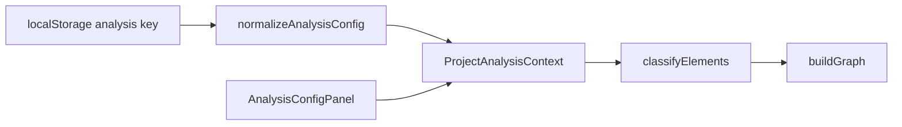

# Динамические классификации в настройках проекта

## Текущее состояние

- Конфиг: `[src/core/config/analysis-config.ts](src/core/config/analysis-config.ts)` — `selectors` и `groupInBucket` с ключами `controlling` / `businessLogic` / `sideEffects`.
- Классификация: `[src/core/model/element-classifier.ts](src/core/model/element-classifier.ts)` — фиксированный порядок и возврат литералов типа.
- Тип узла: `[src/core/model/executable-element.ts](src/core/model/executable-element.ts)` — `ElementType` = union трёх типов + `unclassified`.
- UI: `[src/components/analysis-config-panel.tsx](src/components/analysis-config-panel.tsx)` — три секции с хардкод цветов и названий.
- Граф: `[src/core/graph/graph-builder.ts](src/core/graph/graph-builder.ts)` — `TYPE_STYLES`, бакеты и `rank` завязаны на три литерала.
- Панель узла: `[src/components/graph-view.tsx](src/components/graph-view.tsx)` — хардкод цветов и подписей.
- Персист уже есть: `[src/contexts/project-analysis-context.tsx](src/contexts/project-analysis-context.tsx)` — `useLocalStorage(getAnalysisConfigKey(projectId), …)`; сохранение при каждом `setAnalysisConfig` остаётся без кнопок «Сохранить».

Классы `ControllingElement` / `BusinessLogicElement` / `SideEffectElement` в коде **нигде не импортируются** — можно не трогать или удалить отдельно; в план не включаю.

## Модель данных

**Новый тип записи** (имя условное, например `ClassificationConfig`):

| Поле            | Назначение                                                                                                                                                          |
| --------------- | ------------------------------------------------------------------------------------------------------------------------------------------------------------------- |
| `id`            | Стабильный идентификатор (`uuid` из уже зависимого пакета `uuid` или `crypto.randomUUID()` в браузере)                                                              |
| `name`          | Отображаемое название                                                                                                                                               |
| `color`         | Один из **предопределённых** hex (палитра в одном модуле-константе, напр. `[src/core/config/classification-palette.ts](src/core/config/classification-palette.ts)`) |
| `selectors`     | Текущий `[SelectorConfig](src/core/config/analysis-config.ts)` (`references` / `childsOf` / `decoratedWith`)                                                        |
| `groupInBucket` | То, что сейчас «Сгруппировать в бакет»                                                                                                                              |
| `exclude`       | Только UI + сохранение; **в анализе/графе не использовать**                                                                                                         |
| `mute`          | Аналогично Только UI + сохранение; **в анализе/графе не использовать**                                                                                              |

`**AnalysisConfig`:** удалить `selectors`/`groupInBucket` в старом виде; добавить `classifications: ClassificationConfig[]` (пустой массив по умолчанию). Остальные поля (`include`, `exclude`, `moduleDepth`, …) без изменений.

**Лимит:** не больше **10** записей; кнопка «+» неактивна или показывает подсказку при достижении лимита.

**Порядок правил:** индекс в массиве = приоритет (как сейчас порядок controlling → business → side). **Новая классификация добавляется в начало массива** (как вы просили — «сверху» и выше приоритет).

## Миграция localStorage

Софт не в релизе, миграция старого формата не нужна.

## Классификатор и тип элемента

- `[src/core/model/executable-element.ts](src/core/model/executable-element.ts)`: `ElementType = string` где `**"unclassified"`** — зарезервированное значение; любой другой string — id классификации из конфига. Либо явный тип `ClassificationId | "unclassified"` (оба строковые).
- `[src/core/model/element-classifier.ts](src/core/model/element-classifier.ts)`: для каждого элемента перебирать `config.classifications` **сверху вниз**; первое совпадение `matchesSelector` задаёт `el.type = id`; иначе `unclassified`.
- `[src/core/graph/graph-filter.ts](src/core/graph/graph-filter.ts)`: логика «неклассифицированный» = `type === "unclassified"` — без изменений смысла.

## Граф (бакеты и стили)

- Убрать `TYPE_STYLES` как `Record` по трём литералам; ввести:
  - стиль для `unclassified` (как сейчас серый);
  - для классифицированных: **цвет** брать из записи в `config.classifications` по `el.type === id` (если id устарел после удаления классификации — трактовать как unclassified или fallback-серый — лучше **unclassified-подобный серый** до следующего пересчёта анализа).
- **Форма узла:** зафиксировать одну форму для всех пользовательских классификаций (например `ellipse`, `filled`), чтобы не усложнять UI; при желании позже привязать форму к индексу в палитре.
- **Бакеты:** итерировать `config.classifications`, где `groupInBucket === true`; для каждой строить субграф `cluster_${mod}_bucket_${safeId(id)}` с `label = classification.name`, `color/fontcolor` из записи.
- `**rank` source/sink:** для динамического списка — назначить `rank = source` **первой** (по порядку в массиве) включённой бакет-классификации и `rank = sink` **последней** включённой; остальным бакетам не задавать rank (как у «середины»).

## UI настроек

Файл `[src/components/analysis-config-panel.tsx](src/components/analysis-config-panel.tsx)` (или вынести карточку в отдельный компонент рядом):

1. **Список карточек** — рендер `config.classifications` сверху вниз.
2. **Под списком** — ряд кнопок:
  - **«+»** — новая запись: `id` новый, имя вроде «Новая классификация», цвет — следующий по кругу из палитры, все переключатели выкл, пустые селекторы; вставка в **начало**; уважать лимит 10.
  - **«Template: Django»** — по вашему выбору: **[заменить весь список](ask_question)** на ровно **4** классификации с таким содержимым:
    - **Controlling** — `childsOf`: `BaseWorkflowController`, `BaseCommand`, `BaseViewSet`, `BaseModelViewset`, `BaseModelAdmin`, `ModelAdmin`
    - **BusinessLogic** — `childsOf`: `BaseBusinessAction`
    - **SideEffects** — `decoratedWith`: `.*shared_task.`*
    - **Tests** — `references`: `test.`*, `.*test`; `decoratedWith`: `pytest.`*
3. **Карточка:**
  - Слева **цветная точка**; по клику — **popover** (например `[Popover](https://radix-ui.com)` из уже используемого пакета `radix-ui`, по аналогии с `[tabs.tsx](src/ui/molecules/tabs/tabs.tsx)`) с **рядом/сеткой** предопределённых цветных точек.
  - Поле **названия** (input) стилизованный без видимых рамок, чтобы это просто выглядело редактируемым текстом.
  - Справа **крестик** — удаление записи (с подтверждением необязательно; по желанию только если записей много).
  - **Сверху по центру** — группа из **трёх** переключателей с **иконками** (`lucide-react`) и **тултипами** через `[Tooltip](https://radix-ui.com)` из `radix-ui` (обёртка в `@ui` по правилам из `[.cursor/skills/visualizer-ui/SKILL.md](.cursor/skills/visualizer-ui/SKILL.md)` — при необходимости минимальный `tooltip.tsx` в `src/ui/molecules`).
  - Три **textarea** для `references` / `childsOf` / `decoratedWith` — увеличить `**rows`** по умолчанию (например **5** вместо 2–3).

Все изменения через `onChange` → тот же мгновенный сброс в localStorage, что и сейчас.

## Панель узла и контекст

- `[src/components/graph-view.tsx](src/components/graph-view.tsx)`: цвет и подпись типа брать из `analysisConfig.classifications`: найти запись по `element.type`, иначе показать `element.type` или «Unclassified» для `unclassified`. Для этого панели нужен доступ к `analysisConfig` — уже есть `useProjectAnalysis()` с `projectId`; **добавить в контекст** `analysisConfig` (или только helper `getClassificationMeta(type)`), чтобы не дублировать палитру в компоненте.
- Обновить `[src/contexts/project-analysis-context-shared.ts](src/contexts/project-analysis-context-shared.ts)` и провайдер — проброс `analysisConfig` в значение контекста (если его там ещё нет публично для UI графа).

## Тесты

Обновить фикстуры конфига и ожидания в:

- `[src/core/model/__tests__/element-classifier.test.ts](src/core/model/__tests__/element-classifier.test.ts)`
- `[src/core/__tests__/analyze.test.ts](src/core/__tests__/analyze.test.ts)`
- `[src/core/graph/__tests__/graph-builder.test.ts](src/core/graph/__tests__/graph-builder.test.ts)` — id в именах субграфов изменятся (не `controlling`, а `legacy-…` или явные uuid в тестах)
- `[src/core/graph/__tests__/graph-filter.test.ts](src/core/graph/__tests__/graph-filter.test.ts)` — типы элементов заменить на тестовые id
- `[src/components/graph-view.pipeline.test.tsx](src/components/graph-view.pipeline.test.tsx)`, `[src/core/graph/build-node-subgraph-result.test.ts](src/core/graph/build-node-subgraph-result.test.ts)`, `[src/lib/__tests__/node-search-index.test.ts](src/lib/__tests__/node-search-index.test.ts)`

Добавить **unit-тест** на `normalizeAnalysisConfig` (старый JSON → новый массив).

## Поток данных (кратко)

