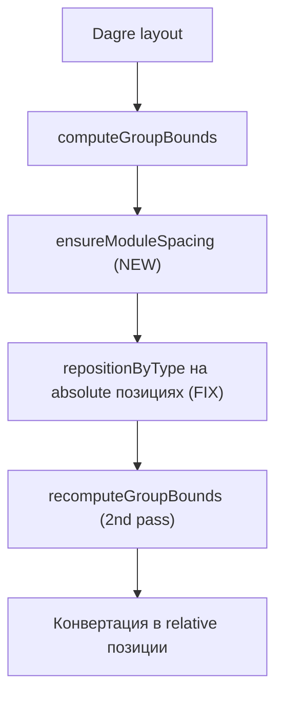

# Фильтрация элементов и правки визуализации

## Контекст

Пайплайн анализа: `scanProject` -> `classifyElements` -> `resolveUses` -> `filterIsolatedNodes` -> `buildGraph` -> `digraphToFlow` (Dagre layout + `repositionByType`).

Типы классификации: `controlling`, `businessLogic`, `sideEffect`, `unclassified` ([src/core/model/executable-element.ts](src/core/model/executable-element.ts)).

---

## 1. Фильтрация неклассифицированных элементов

### Что

Добавить настройку `hideUnclassified: boolean` (по умолчанию `true`). Когда включена -- удалять `unclassified` ноды, которые **не ведут** (по цепочке `uses`) ни к одной классифицированной ноде.

### Алгоритм фильтрации

- Все classified ноды -- оставляем безусловно
- Для каждой unclassified ноды -- DFS по цепочке `uses`; если достижима хотя бы одна classified нода -- оставляем
- Мемоизация результата для избежания повторных обходов; `visited` set для защиты от циклов

### Файлы

- **[src/core/config/analysis-config.ts](src/core/config/analysis-config.ts)** -- добавить поле `hideUnclassified: boolean` в `AnalysisConfig`, в `DEFAULT_ANALYSIS_CONFIG` выставить `true`
- **[src/core/graph/graph-filter.ts](src/core/graph/graph-filter.ts)** -- новая функция `filterUnclassifiedNodes(elements, elementSet)`:

```typescript
export function filterUnclassifiedNodes(
  elements: ExecutableElement[],
): ExecutableElement[] {
  const elementSet = new Set(elements);
  const cache = new Map<ExecutableElement, boolean>();

  function reachesClassified(
    el: ExecutableElement,
    visited: Set<ExecutableElement>,
  ): boolean {
    if (cache.has(el)) return cache.get(el)!;
    if (el.type !== "unclassified") return true;
    if (visited.has(el)) return false;

    visited.add(el);
    for (const target of el.uses) {
      if (elementSet.has(target) && reachesClassified(target, visited)) {
        cache.set(el, true);
        return true;
      }
    }
    cache.set(el, false);
    return false;
  }

  return elements.filter(
    (el) => el.type !== "unclassified" || reachesClassified(el, new Set()),
  );
}
```

- **[src/core/analyze.ts](src/core/analyze.ts)** -- вызвать `filterUnclassifiedNodes` после `filterIsolatedNodes`, если `config.hideUnclassified !== false`
- **[src/components/analysis-config-panel.tsx](src/components/analysis-config-panel.tsx)** -- добавить чекбокс/свитч "Скрыть неклассифицированные" между блоком Include/Exclude и moduleDepth

---

## 2. Отступы между модулями

### Проблема

В [src/core/graph/digraph-to-flow.ts](src/core/graph/digraph-to-flow.ts) Dagre получает группы-модули как `1x1` (строка 164). После layout `computeGroupBounds` вычисляет реальные размеры, но не корректирует позиции модулей -- они могут оказаться вплотную или даже перекрываться.

### Решение

Добавить `ensureModuleSpacing` -- постобработку после `computeGroupBounds`:

- Берем все top-level группы (модули -- без `parentId`)
- Сортируем по X (layout LR)
- Для каждой пары проверяем зазор: `gap = curr.x - (prev.x + prev.width)`
- Если `gap < MODULE_SPACING`, сдвигаем текущий модуль и **все его дочерние элементы** в `absolutePositions` на `MODULE_SPACING - gap` по X
- Сдвиг кумулятивный (каждый следующий модуль учитывает суммарный сдвиг предыдущих)
- Константа `MODULE_SPACING = 60` (подбирается визуально)

Вызывать в `applyDagreLayout` после `computeGroupBounds`, до конвертации в relative позиции.

---

## 3. Позиционирование Controlling нод (левая граница модуля)

### Проблема

В `repositionByType` (строка 299) координаты `position.x` берутся у нод с **разными родителями**: прямые дети модуля имеют позицию относительно модуля, а вложенные (через class-группу) -- относительно class-группы. Сравнение и присвоение `minX` смешивает системы координат.

### Решение

Добавить хелпер для вычисления **позиции относительно модуля**:

```typescript
function getModuleRelativePos(
  node: FlowNode,
  nodeMap: Map<string, FlowNode>,
  moduleId: string,
): { x: number; y: number } {
  let x = node.position.x;
  let y = node.position.y;
  let current = nodeMap.get(node.parentId ?? "");
  while (current && current.id !== moduleId) {
    x += current.position.x;
    y += current.position.y;
    current = nodeMap.get(current.parentId ?? "");
  }
  return { x, y };
}
```

И обратный хелпер для конвертации модуле-относительной позиции в parent-relative:

```typescript
function setModuleRelativePos(
  node: FlowNode,
  moduleRelPos: { x: number; y: number },
  nodeMap: Map<string, FlowNode>,
  moduleId: string,
): void {
  let offsetX = 0, offsetY = 0;
  let current = nodeMap.get(node.parentId ?? "");
  while (current && current.id !== moduleId) {
    offsetX += current.position.x;
    offsetY += current.position.y;
    current = nodeMap.get(current.parentId ?? "");
  }
  node.position = {
    x: moduleRelPos.x - offsetX,
    y: moduleRelPos.y - offsetY,
  };
}
```

В блоке controlling (строка 332):

- Вычислить module-relative X для всех элементов модуля
- Найти `minX` среди module-relative координат
- Для каждой controlling ноды: установить module-relative X = minX через `setModuleRelativePos`

---

## 4. Позиционирование Side Effect нод (верхняя граница модуля)

### Проблема

Та же проблема со смешиванием систем координат, что и у controlling.

### Решение

В блоке sideEffect (строка 342):

- Вычислить module-relative Y для всех элементов модуля
- Найти `minY` среди module-relative координат
- Для каждой sideEffect ноды: установить module-relative Y = minY, X рассчитать с шагом `NODE_WIDTH + 20` (текущая логика), через `setModuleRelativePos`

---

## 5. Пересчет границ групп после repositionByType

После перемещения controlling/sideEffect нод, границы групп (class и module) могут стать неактуальными. Нужно:

- После `repositionByType` в `digraphToFlow` пересчитать `absolutePositions` из relative positions
- Перезапустить `computeGroupBounds`
- Пересчитать relative positions

Альтернативный подход -- перенести `repositionByType` в `applyDagreLayout`, до конвертации из absolute в relative, и работать с absolute позициями напрямую. Это проще и корректнее.

---

## Порядок изменений в `digraph-to-flow.ts :: applyDagreLayout`




Перенос `repositionByType` внутрь `applyDagreLayout` (до конвертации в relative) позволяет:

- Работать с единой системой абсолютных координат
- Не нужны хелперы module-relative -- все уже absolute
- `computeGroupBounds` вызывается повторно после repositioning для корректных границ

