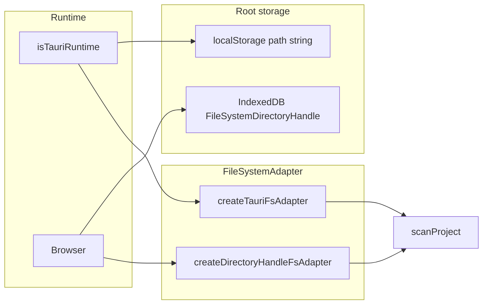

# PWA + чтение каталога в браузере (без второй точки входа SPA)

## Контекст в коде

- Контекст анализа уже опирается на абстракцию `[FileSystemAdapter](src/core/parser/project-scanner.ts)` (`readFile`, `listDir`). Парсер и `[scanProject](src/core/parser/project-scanner.ts)` менять не нужно — достаточно подставить второй адаптер.
- Сейчас `[ProjectAnalysisProvider](src/contexts/project-analysis-context.tsx)` жёстко использует Tauri (`open`, `readDir`, `readTextFile`) и отсекает браузер через `isTauriRuntime()` в `pickDirectory`, `refreshCount`, `runAnalysis` и в эффектах.
- Сообщения «доступно только в Tauri» дублируются в UI: `[src/routes/$projectId/index.tsx](src/routes/$projectId/index.tsx)`, `[src/routes/$projectId/node-sub-graph/$nodeRef.tsx](src/routes/$projectId/node-sub-graph/$nodeRef.tsx)`.
- Подсчёт файлов — отдельный Tauri-путь: `[src/lib/count-project-files.ts](src/lib/count-project-files.ts)` (`plugin-fs` + `homeDir`).
- `[public/manifest.json](public/manifest.json)` уже похож на PWA, но в `[src/routes/__root.tsx](src/routes/__root.tsx)` нет `<link rel="manifest">`, service worker не подключён.

## Архитектура (одна кодовая база)

**Отдельные HTML entry points не нужны**: и Tauri, и деплой как сайт используют тот же клиентский бандл. Различие — **рантайм** (`__TAURI_INTERNALS__`) и **опции Vite** при сборке.

## 1. Доступ к ФС в браузере (только чтение)

- Добавить модуль (например `[src/lib/directory-handle-fs-adapter.ts](src/lib/directory-handle-fs-adapter.ts)`):
  - `createDirectoryHandleFsAdapter(root: FileSystemDirectoryHandle): FileSystemAdapter`
  - `listDir("")` — перечисление корня; для вложенных путей — обход сегментов через `getDirectoryHandle` / `getFileHandle` (с `create: false`).
  - `readFile(relativePath)` — `getFile()` + `file.text()` (как сейчас по сути нужен текст для парсера).
- Опционально: `showDirectoryPicker({ mode: "read" })` там, где поддерживается; иначе вызов без опций.
- **Персистентность**: строковый путь с диска в браузере не восстановить. Хранить `FileSystemDirectoryHandle` в **IndexedDB** (ключ — `projectId` или отдельный uuid). В **localStorage** хранить только метаданные для UI (например имя каталога `handle.name`), чтобы не смешивать с текущим `[PROJECT_PATHS_STORAGE_KEY](src/types/project.ts)` для Tauri.
  - При загрузке страницы: взять хэндл из IDB → при необходимости `[requestPermission({ mode: "read" })](https://developer.mozilla.org/en-US/docs/Web/API/FileSystemHandle/requestPermission)` (после перезагрузки).
- **Миграция / совместимость**: существующие значения `visualizer-project-paths` оставить для Tauri. В браузере при `isTauriRuntime() === false` не пытаться читать проект по абсолютному пути из localStorage — пользователь один раз заново выбирает папку; при желании можно показать подсказку, если в storage есть «тауровский» путь.

## 2. Рефакторинг `[project-analysis-context.tsx](src/contexts/project-analysis-context.tsx)`

- Развести ветки:
  - **Tauri**: динамический `import()` плагинов (`dialog`, `fs`) **внутри** функций (как уже сделано в `[dot-svg-canvas.tsx](src/components/dot-svg-canvas.tsx)`), чтобы не тянуть Tauri в SSR/пререндер и уменьшить риск импорта на сервере.
  - **Браузер**: `showDirectoryPicker` → сохранить хэндл + label; построить `createDirectoryHandleFsAdapter` и вызвать тот же `scanProject("", fs)`.
- Заменить проверки «только Tauri» на «есть валидный корень для текущей среды» + обработка отмены диалога / отсутствия API (`typeof window.showDirectoryPicker`).
- `refreshCount` в браузере: рекурсивный обход через тот же хэндл (новая функция рядом с `[countFilesRecursive](src/lib/count-project-files.ts)` или общий обход по `FileSystemAdapter` без дублирования логики игнорируемых каталогов — по желанию через лёгкий shared helper).

## 3. UI: убрать искусственные ограничения

- Удалить ветки `!isTauriRuntime()` с текстом про десктоп в:
  - `[src/routes/$projectId/index.tsx](src/routes/$projectId/index.tsx)`
  - `[src/routes/$projectId/node-sub-graph/$nodeRef.tsx](src/routes/$projectId/node-sub-graph/$nodeRef.tsx)`
- В настройках / секции каталога (`[project-directory-section.tsx](src/components/project/project-directory-section.tsx)`) по-прежнему показывать выбранный корень: в Tauri — путь, в браузере — сохранённый label.

## 4. PWA (установка из браузера)

- Подключить `**vite-plugin-pwa`** в `[vite.config.ts](vite.config.ts)`.
- **Не генерировать SW для сборки под Tauri**: при `[beforeBuildCommand](src-tauri/tauri.conf.json)` (`pnpm build:vite`) Tauri задаёт переменные окружения `TAURI_ENV_`* (в т.ч. `TAURI_ENV_PLATFORM`). Включать плагин PWA только если `**TAURI_ENV_PLATFORM` не задан** (и при необходимости дополнительный флаг `VITE_ENABLE_PWA` для CI/ручного отключения).
- Обновить `[public/manifest.json](public/manifest.json)` (имя приложения, при необходимости `id` / `scope` / `start_url` под ваш хостинг).
- В `[src/routes/__root.tsx](src/routes/__root.tsx)` добавить в `head.links` `rel: "manifest"`, `href: "/manifest.json"` (и при необходимости `theme-color` meta).

Итог: `pnpm tauri build` → статика **без** агрессивного SW; `pnpm build:vite` для деплоя на HTTPS → **с** PWA. Локально для проверки PWA — `pnpm build:vite && pnpm preview` (или dev-режим плагина).

## 5. Ограничения и проверка

- **HTTPS** (или `localhost`) нужен и для установки PWA, и для File System Access API в продакшене.
- Поддержка `showDirectoryPicker`: в основном Chromium; Safari/Firefox — проверить актуальность; при отсутствии API — понятное сообщение пользователю.
- Экспорт SVG уже имеет ветку браузера (`showSaveFilePicker` / скачивание) в `[dot-svg-canvas.tsx](src/components/dot-svg-canvas.tsx)` — менять не обязательно.

## Ключевые файлы

| Зона                 | Файлы                                                                                                                                                     |
| -------------------- | --------------------------------------------------------------------------------------------------------------------------------------------------------- |
| Адаптер + IDB + pick | новые `src/lib/...`                                                                                                                                       |
| Контекст анализа     | `[src/contexts/project-analysis-context.tsx](src/contexts/project-analysis-context.tsx)`                                                                  |
| Подсчёт файлов       | `[src/lib/count-project-files.ts](src/lib/count-project-files.ts)` + браузерный аналог или общий helper                                                   |
| Маршруты графа       | `[src/routes/$projectId/index.tsx](src/routes/$projectId/index.tsx)`, `[node-sub-graph/...](src/routes/$projectId/node-sub-graph/$nodeRef.tsx)`           |
| PWA                  | `[vite.config.ts](vite.config.ts)`, `[__root.tsx](src/routes/__root.tsx)`, `[package.json](package.json)`, `[public/manifest.json](public/manifest.json)` |

