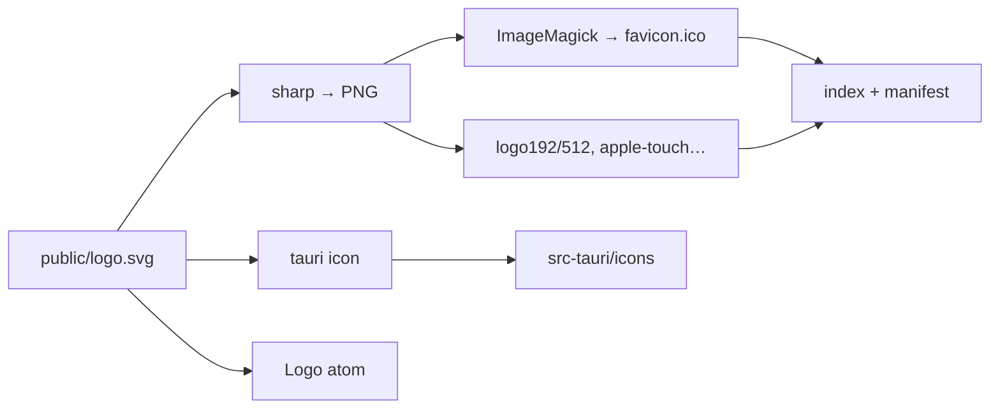

# Внедрение логотипа (favicon, PWA, Tauri, UI)

## Текущее состояние

- В [`index.html`](index.html) нет `<link rel="icon">` — только заголовок.
- [`public/manifest.webmanifest`](public/manifest.webmanifest) и [`vite.config.ts`](vite.config.ts) (блок `VitePWA` → `manifest` / `includeAssets`) ссылаются на `favicon.ico`, `logo192.png`, `logo512.png`, но этих файлов в [`public/`](public/) **нет** — иконки PWA и кэш по ним фактически сломаны.
- [`src-tauri/tauri.conf.json`](src-tauri/tauri.conf.json) ожидает набор в [`src-tauri/icons/`](src-tauri/icons/).
- Главная: [`src/routes/index.tsx`](src/routes/index.tsx); шапка: [`src/components/AppShell.tsx`](src/components/AppShell.tsx).

Исходник — SVG 100×100 с прозрачным фоном; подходит для векторного favicon и для растра.

## Схема

1. **Файл в репозитории**  
   Скопировать исходный SVG в **`public/logo.svg`** (по желанию убрать HTML-комментарии внутри файла).

2. **`pnpm icons:generate`** (например `scripts/generate-icons-from-logo.mjs`)

   - **PNG через `sharp` только** (рендер `public/logo.svg` → PNG в `public/`):
     - `logo192.png`, `logo512.png`, `apple-touch-icon.png` (180×180).
     - Промежуточные размеры для ICO: например **16×16, 32×32, 48×48** (можно писать во временную папку `node_modules/.cache/...` или в `public/` с префиксом вроде `favicon-16.png` — если не хотите лишние файлы в репо, удалять после сборки ICO или класть только в `.gitignore`-кэш и коммитить лишь `favicon.ico`).
   - **`favicon.ico`**: без Node-библиотек для ICO — одна **внешняя команда ImageMagick**, собирающая мультиразмерный ICO из PNG, например:
     - IM v7: `magick favicon-16.png favicon-32.png favicon-48.png public/favicon.ico`
     - IM v6: `convert favicon-16.png favicon-32.png favicon-48.png public/favicon.ico`  
     Скрипт может пробовать `magick`, при ошибке — `convert` (или наоборот), и падать с понятным сообщением, если ImageMagick не установлен.
   - После прогона **закоммитить** `favicon.ico`, `logo192.png`, `logo512.png`, `apple-touch-icon.png` (и `logo.svg`), чтобы CI и клон без ImageMagick/sharp всё ещё собирали фронт.

3. **Зависимости npm**  
   Только **`sharp`** как devDependency для скрипта. ImageMagick — **системная** утилита у разработчика (и при необходимости в CI, если когда-нибудь будете генерировать иконки там); в `package.json` не тянем `to-ico` и прочие ICO-либы.

4. **HTML и PWA**  
   - [`index.html`](index.html): `rel="icon" type="image/svg+xml"` → `/logo.svg`; дублирующий `rel="icon"` на `/favicon.ico` для старых клиентов; `apple-touch-icon` на PNG.
   - Манифест + [`vite.config.ts`](vite.config.ts): иконки синхронны (в т.ч. `favicon.ico`, PNG 192/512, опционально запись для `logo.svg` с `type: image/svg+xml`).

5. **Tauri**  
   `pnpm exec tauri icon public/logo.svg` → **`src-tauri/icons/`**, закоммитить.

6. **UI**  
   Атом **`src/ui/atoms/logo/logo.tsx`**, [`Home`](src/routes/index.tsx), [`AppShell`](src/components/AppShell.tsx), `import.meta.env.BASE_URL + 'logo.svg'`; Storybook: `staticDirs: ['../public']` + `logo.stories.tsx`.

## Проверка

- Локально: после смены SVG — `pnpm icons:generate` (нужны sharp + ImageMagick).
- Браузер / PWA: нет 404 по иконкам; вкладка показывает favicon.
- `pnpm tauri build` — иконки окна из `src-tauri/icons`.
