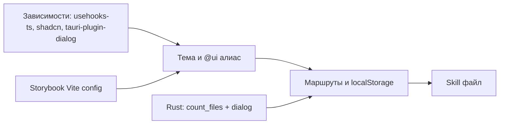

# План настройки проекта visualizer

## Контекст репозитория

- Стек: [package.json](package.json) — **pnpm**, **Vite 7**, **TanStack Start** + [vite.config.ts](vite.config.ts) (`tanstackStart`, `nitro`, `tailwindcss`), **React 19**, **Tailwind v4** ([src/styles.css](src/styles.css)), **Tauri 2** ([src-tauri/](src-tauri/)).
- Роутинг: файловый TanStack Router, дерево генерируется в [src/routeTree.gen.ts](src/routeTree.gen.ts) (после добавления файлов маршрутов — перегенерация через dev/build).
- Сейчас алиас только `[@/*` → `./src/*](tsconfig.json)`; понадобится `**@ui/*`**.

---

## 1. shadcn/ui (Radix) + семантические цвета Tailwind

- Инициализация CLI: `pnpm dlx shadcn@latest init` в корне с учётом **Tailwind v4** (официальный гайд для Vite: [Installation / Vite](https://ui.shadcn.com/docs/installation/vite)).
- В [components.json](components.json) (создаётся CLI) задать:
  - базовый путь компонентов под `**src/ui`** и алиасы так, чтобы импорты шли через `**@ui/...`** (расширить [tsconfig.json](tsconfig.json): `"@ui/*": ["./src/ui/*"]`; [vite.config.ts](vite.config.ts) уже подхватывает пути через `vite-tsconfig-paths`).
- **Семантическая тема**: привести [src/styles.css](src/styles.css) к паттерну shadcn для v4: переменные `--background`, `--foreground`, `--primary`, `--muted`, `--border`, `--ring` и маппинг в `@theme` / `@layer base`, чтобы в разметке использовать `**bg-background`**, `**text-foreground`**, `**border-border**` и т.д., а не «сырые» палитры.
- **Структура atoms / molecules / organisms**: CLI по умолчанию кладёт файлы в `components/ui`. План:
  - либо указывать целевую папку при добавлении компонентов (если поддерживается флагом/path в вашей версии CLI),
  - либо генерировать в согласованный подкаталог и **переносить** в, например, `src/ui/molecules/button/`, поправив импорты `cn` и `@ui/...`.
- Минимальный набор для каркаса приложения: **Button**, **Tabs** (вкладки проектов), при необходимости **Card** — каждый в **своей директории** с парами:
  - `button.tsx` / `button.stories.tsx` (как в вашем примере с [src/ui](src/ui) — единый стиль имён файлов по компоненту).
- Существующий [src/components/RoundedButton.tsx](src/components/RoundedButton.tsx): по желанию заменить использованием `@ui/...` или оставить до следующей итерации (в плане реализации — не раздувать объём: подключить новый UI на новых экранах).

---

## 2. Storybook (последняя версия) + autodoc

- Установка: `pnpm dlx storybook@latest init` (React + Vite).
- Включить **@storybook/addon-docs** (в актуальных шаблонах часто входит в essentials; при необходимости добавить явно) и в мета-сторис использовать `**tags: ['autodocs']`** (или эквивалент для вашей мажорной версии) для автогенерации доки.
- Отдельная конфигурация Vite для Storybook: **не** подключать `tanstackStart()` / `nitro()` как в [vite.config.ts](vite.config.ts) — в `[.storybook/main.ts](.storybook/main.ts)` через `viteFinal` объединить минимально нужное: `**@tailwindcss/vite`**, `**vite-tsconfig-paths`** (алиасы `@/` и `@ui/`), `@vitejs/plugin-react`. Иначе сборка Storybook часто ломается на плагинах Start.
- Скрипты в [package.json](package.json): `storybook`, `build-storybook`.

---

## 3. Зависимости приложения

- `**usehooks-ts**`: `useLocalStorage` для состояния проектов и путей.
- **Tauri Dialog**: `@tauri-apps/plugin-dialog` + регистрация плагина в Rust ([src-tauri/src/lib.rs](src-tauri/src/lib.rs), [src-tauri/Cargo.toml](src-tauri/Cargo.toml)) и права в [src-tauri/capabilities/default.json](src-tauri/capabilities/default.json) (разрешения на открытие диалога выбора каталога по документации Tauri 2 для `plugin-dialog`).

Подсчёт файлов в выбранной пользователем директории:

- Плагин `@tauri-apps/plugin-fs` в основном рассчитан на **BaseDirectory + относительные пути** и жёсткие **scope** в capabilities; чтобы запросить произвольный абсолютный путь с диалога нужно кстановить широкий scope.
- НЕ писать свой rust код

---

## 4. Роутинг и данные

**Маршруты (верхний уровень):**

| Путь          | Назначение                                                                                        |
| ------------- | ------------------------------------------------------------------------------------------------- |
| `/`           | Список проектов, кнопка «Новый проект» (генерация `crypto.randomUUID()`), навигация на `/${uuid}` |
| `/$projectId` | Экран проекта: выбор директории, заготовка лейаута, отображение **числа файлов**                  |

Файлы TanStack Router: например [src/routes/index.tsx](src/routes/index.tsx) остаётся домом; добавить `**src/routes/$projectId.tsx`** с параметром `projectId` (UUID в строке URL).

**Логика:**

- Тип `Project`: `{ id: string; name: string; createdAt: number }` (или аналог).
- `useLocalStorage<Project[]>('…', [])` — список проектов.
- Отдельно `useLocalStorage<Record<string, string>>('…', {})` **id проекта → абсолютный путь** к корню проекта на диске (или один объединённый объект — на выбор реализации, главное — usehooks-ts и персистенция).
- В `**$projectId`**: если UUID невалиден или проекта нет в списке — редирект на `/` или пустое состояние.
- Вкладки: компонент на базе shadcn **Tabs** (или список ссылок с активным стилем) — элементы из `projects`, переход `navigate({ to: '/$projectId', params: { projectId: id } })` (точный API — из `@tanstack/react-router`).

**Лейаут:** общая оболочка может жить в [src/routes/__root.tsx](src/routes/__root.tsx) (шапка с вкладками) или в layout-роуте, если позже разделите; для MVP достаточно корня + двух страниц.

---

## 5. Cursor Skill с правилами

Создать проектный skill, например `**[.cursor/skills/visualizer-ui/SKILL.md](.cursor/skills/visualizer-ui/SKILL.md)`** (рекомендуемое место по [create-skill](file:///Users/lev/.cursor/skills-cursor/create-skill/SKILL.md): проектные skills в `.cursor/skills/`).

Содержание skill (кратко, для агента):

- Компоненты только под `**src/ui`**, алиас `**@ui/`**, иерархия **atoms / molecules / organisms**.
- Каждый компонент — **папка** с `*.tsx` и `***.stories.tsx`**.
- Стили — **семантические** классы темы (background, foreground, primary, …), не хардкод палитры без причины.
- Storybook: autodocs, паттерн мета-тегов.

Frontmatter `name` / `description` — чтобы skill находился по смыслу («UI-компоненты visualizer, shadcn, Storybook»).

---

## 6. Порядок внедрения (рекомендуемый)

1. Зависимости и `components.json` + тема + алиас `@ui`.
2. Первые shadcn-компоненты в нужных подпапках + сторис.
3. Storybook с рабочим Vite-алиасом и одной сторис из `@ui`.
4. Tauri: dialog + Rust `count_files_in_dir`.
5. Роуты `/` и `/$projectId`, UI вкладок и экран проекта.
6. Skill в `.cursor/skills/.../SKILL.md`.

---

## Риски и примечания

- **Порядок маршрутов**: индекс `/` должен оставаться точным совпадением; динамика — в `$projectId`.
- `**pnpm dev:vite` без Tauri**: `invoke` для подсчёта файлов и dialog не сработают — в UI можно показать заглушку или проверку `import.meta.env` / `@tauri-apps/api/core` `isTauri` (опционально).

